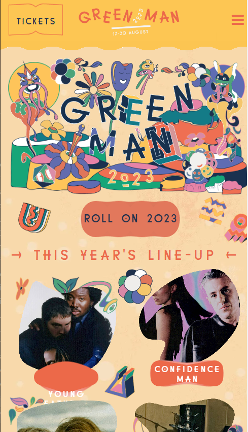

# 博客设计


## 主页分两份


https://www.bilibili.com/video/BV1Gb4y167vm/?spm_id_from=333.788.recommend_more_video.13

地址：无

下滑变成这个


https://www.bilibili.com/video/BV19W4y1H7dj/?spm_id_from=333.788.recommend_more_video.11

地址：[毛玻璃UI - 个人主页（开源版）: 毛玻璃拟态UI个人主页是小枫原创的一款简约风格开源的新UI主页设计。 (gitee.com)](https://gitee.com/xfwlclub/Glass-UI)

移动端适配参照这个


https://www.bilibili.com/video/BV1ar4y1s7Mm/?spm_id_from=333.788.recommend_more_video.6

[额外参照1](https://www.bilibili.com/video/BV1SM411w7VZ/?buvid=XY9C54C955C2E4CC1CC5AD076A55937715A66&is_story_h5=false&mid=uXPNrPsM8ANrab25UbhtFw%3D%3D&p=1&plat_id=116&share_from=ugc&share_medium=android&share_plat=android&share_session_id=b3ff9b45-060a-4c47-85a1-93aae4531fb3&share_source=WEIXIN&share_tag=s_i&timestamp=1688011368&unique_k=H8s9ghB&up_id=480493680)

[额外参照2](https://www.bilibili.com/video/BV1Cv4y1y7oN/?buvid=XY9C54C955C2E4CC1CC5AD076A55937715A66&is_story_h5=false&mid=uXPNrPsM8ANrab25UbhtFw%3D%3D&p=1&plat_id=116&share_from=ugc&share_medium=android&share_plat=android&share_session_id=012a5d20-024b-4395-8d80-b1d9855a7fc1&share_source=WEIXIN&share_tag=s_i&timestamp=1688011135&unique_k=ON54L0G&up_id=1886736881)

[额外参照3](https://www.bilibili.com/video/BV1ZM4y1w7iL/?buvid=XY9C54C955C2E4CC1CC5AD076A55937715A66&is_story_h5=false&mid=uXPNrPsM8ANrab25UbhtFw%3D%3D&p=1&plat_id=116&share_from=ugc&share_medium=android&share_plat=android&share_session_id=a37d6f90-4de5-4d14-b714-73154f150559&share_source=WEIXIN&share_tag=s_i&timestamp=1688011226&unique_k=gDswEVG&up_id=479258652)

额外参照↓https://www.greenman.net/



包含内容：

1. 我的名字
2. 我的座右铭
3. 我的欢迎语
4. 产出内容（文章，视频，无稽之谈）
5. 邮箱微博qq
6. 常用网站，站内搜索，音乐

## 初始化阶段

初始化基本dom结构，规范基本元素样式。

例如：使用W3C语义化模板，header - main - footer - section

每个大模块下先使用container囊括，container同样需要统一规范化。

### 1.使用*选择器规定盒模型

paddinig、margin、box-sizing

### 2.设置全局变量

- 设置颜色 xxColor
- 设置字体 ffOne、ffTwo

### 3.设置html字体大小

- 设置文字大小，假如是通过rem进行响应式设计的话

- 设置滚动，如果需要做页内跳转标签的话

  ```css
  html {
      scroll-behavior: smooth;
      font-size: 62.5%;
  }
  ```

### 4.设置body背景板

- 指定字体
- 设置字体重量
- 设置背景图片/颜色

### 5.规范各种元素样式

- h1-h6的字体family, 字体重量, text-transform?, 字体颜色?

- p的字体family, 字体重量, text-transform?, 字体颜色?, line-height.

- ul的list-style: none?

- a的text-decoration: none?

- img的width: 100%?

- section的padding-top, position, overflow

  > section用于区分模块的, 例如home, about, 体育, 文学啥的, 一个main中一般多对出现用于区分各个板块

### 6.规范常用的类

常用的类container!, title, btn, social(图标)

#### .container

`padding-left/right`, `margin-left/right` , `width: ?100%`

```css
.container {
    padding-left: 1.5rem;
    padding-right: 1.5rem;
    margin-left: auto;
    margin-right: auto;
    width: 100%;
}
```

#### .title

font-size, margin-bottom, position: ?relative, 字体颜色, 行高line-height

```css
.title {
    font-size: 3.2rem;
    position: relative;
    color: var(--yellowColor);
    line-height: 2.4rem;
    margin-bottom: 4rem;
}
```

#### .btn

```css
.btn {
    display: inline-block;
    font-size: 2rem;
    text-align: center;
    line-height: 2.4rem;
    background-color: var(--yellowColor);
    border-radius: 3.5rem;
    transition: all 0.5s ease;
}
```

#### .social

border, border-radius, width/height, color, line-height, 过渡, 居中text-align, font-size 

```css
.social {
    display: block;
    border: 0.1rem solid var(--yellowColor);
    color: var(--yellowColor);
    font-size: 1.6rem;
    width: 3.8rem;
    height: 3.8rem;
    line-height: 3.6rem;
    text-align: center;
    border-radius: 50%;
    transition: all 0.5s ease;
}
```

## 主页弹幕

css动画， transform: translateY() 计算可视区域-100%元素宽度

## 主页垂直居中

## 响应式布局

rem随最小宽度变化62.5->70%

